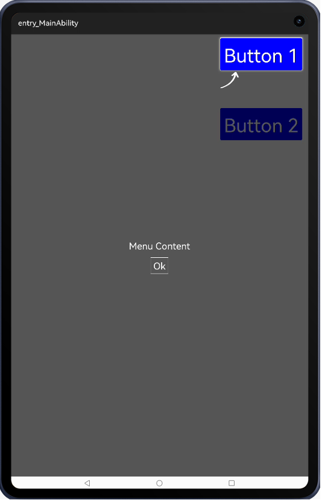

# EasyGuideView

A HMOS library which provides guide highlighting tips, simple and easy to use

## Source
Inspired by [smuyyh/EasyGuideView](https://github.com/smuyyh/EasyGuideView)

## Feature
A HMOS library which provides guide highlighting tips, simple and easy to use




## Dependency
1. For using easyguideview module in sample app, include the source code and add the below dependencies in entry/build.gradle to generate hap/support.har.
```groovy
	dependencies {
		implementation project(':easyguideview')
                implementation fileTree(dir: 'libs', include: ['*.har'])
                testImplementation 'junit:junit:4.13'
	}
```
2. For using easyguideview in separate application using har file, add the har file in the entry/libs folder and add the dependencies in entry/build.gradle file.
```groovy
	dependencies {
		implementation fileTree(dir: 'libs', include: ['*.har'])
		testImplementation 'junit:junit:4.13'
	}
```

## Usage

#### In code

```java
public void show(Component view) {
	int[] loc = view.getLocationOnScreen();
	Component tipsView = createTipsView();
	if (easyGuide != null && easyGuide.isShowing())
		easyGuide.dismiss();
	easyGuide = new EasyGuide.Builder(MainAbilitySlice.this)
			.addHightArea(view, HShape.RECTANGLE)
			.addParentView(mParentView)
			.addView(tipsView, 0, loc[1] + view.getHeight() - 130, new DependentLayout.LayoutConfig(ComponentContainer.LayoutConfig.MATCH_PARENT, ComponentContainer.LayoutConfig.MATCH_CONTENT))
			.dismissAnyWhere(false)
			.build();
	easyGuide.show();
}

private Component createTipsView() {
	Component component = LayoutScatter.getInstance(this).parse(ResourceTable.Layout_tips_view, null, false);
	Image ivIsee = (Image) component.findComponentById(ResourceTable.Id_ivIsee);
	ivIsee.setClickedListener(new Component.ClickedListener() {
		@Override
		public void onClick(Component component) {
			if (easyGuide != null) {
				easyGuide.dismiss();
			}
		}
	});
	return component;
}
```
Callback events

```java
easyGuide.setOnStateChangedListener(new OnStateChangedListener() {
	@Override
	public void onShow() {
		
	}

	@Override
	public void onDismiss() {
		
	}

	@Override
	public void onHeightlightViewClick(Component view) {
		
	}
});
```


## License
```
Copyright (C) 2016 smuyyh

Licensed under the Apache License, Version 2.0 (the "License");
you may not use this file except in compliance with the License.
You may obtain a copy of the License at

   http://www.apache.org/licenses/LICENSE-2.0

Unless required by applicable law or agreed to in writing, software
distributed under the License is distributed on an "AS IS" BASIS,
WITHOUT WARRANTIES OR CONDITIONS OF ANY KIND, either express or implied.
See the License for the specific language governing permissions and
limitations under the License.
```
